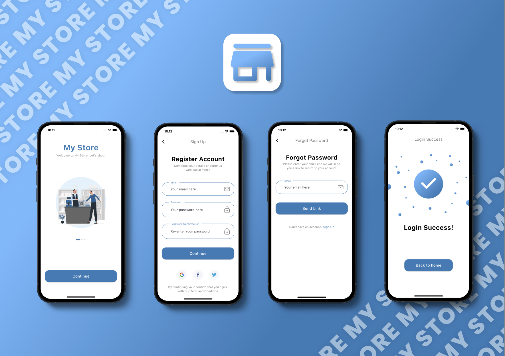

# 🛍️ My Store - E-commerce App

Welcome to **My Store**, your personalized shopping experience built using Flutter! 🎉 This app brings a wide range of products right to your fingertips, making shopping easy, fun, and accessible. Explore the latest trends, find the best deals, and enjoy a seamless shopping journey with My Store.

## 🛒 What's Inside?

- **Product Info:** Dive into detailed descriptions of each product, including key features, prices, and what makes them special.
- **Categories & Collections:** Effortlessly browse through various categories and curated collections to find exactly what you're looking for.
- **User Reviews:** Read reviews from other shoppers to help you make the best purchase decisions.
- **Cart & Checkout:** A smooth and secure checkout process, allowing you to manage your cart and complete purchases with ease.
- **Order Tracking:** Keep track of your orders with real-time updates so you always know when your items will arrive.

## 🎯 Why My Store?

Because shopping should be simple, enjoyable, and tailored to your needs! Whether you're looking for the latest fashion, must-have gadgets, or everyday essentials, My Store makes it all possible with just a few taps.

## 📸 Screenshots

Here’s a sneak peek at what you can expect:

