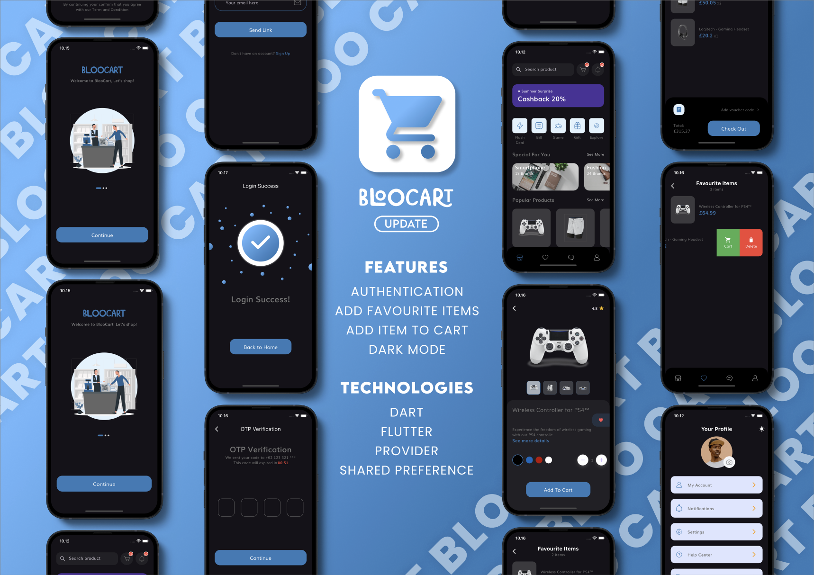

# 🛍️ BlooCart - E-commerce App  

Welcome to **BlooCart**, your personalized shopping experience built using Flutter! 🎉 
This app brings a wide range of products right to your fingertips, making shopping easy, fun, and accessible. Explore the latest trends, find the best deals, and enjoy a seamless shopping journey with BlooCart.  

---

## 🛒 What's Inside?  

- **Product Info:**  
  Dive into detailed descriptions of each product, including key features, prices, and what makes them special.  

- **Categories & Collections:**  
  Effortlessly browse through various categories and curated collections to find exactly what you're looking for.  

- **User Reviews:**  
  Read reviews from other shoppers to help you make the best purchase decisions.  

- **Cart & Checkout:**  
  A smooth and secure checkout process, allowing you to manage your cart and complete purchases with ease.  

- **Order Tracking:**  
  Keep track of your orders with real-time updates so you always know when your items will arrive.  

---

## ✨ Latest Updates  

We're always working to make your shopping experience even better! Here’s what’s new:  

- **Using Provider:**  
  We've enhanced state management to ensure smooth and responsive app performance.  

- **Dark Themes:**  
  Switch to a stylish dark theme for a more comfortable shopping experience at night.  

- **Shared Preferences:**  
  Enjoy personalized settings that save your preferences for a seamless user experience.  

- **Favourite Items:**  
  Mark your must-have products and quickly access them anytime.  

- **Favourite Button:**  
  A handy button added for easy product favoriting – never lose track of the things you love!  

---

## 🎯 Why BlooCart?  

Because shopping should be simple, enjoyable, and tailored to your needs!  
Whether you're looking for the latest fashion, must-have gadgets, or everyday essentials, BlooCart makes it all possible with just a few taps.  

---

## 📸 Screenshots  

Here’s a sneak peek at what you can expect:  

  